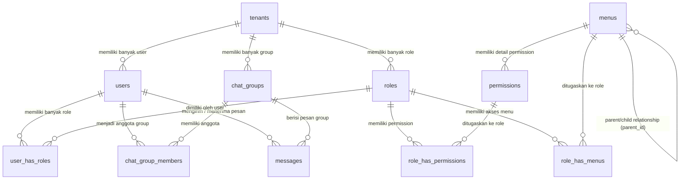

# Dokumentasi Database & Struktur Tabel

Dokumen ini berisi penjelasan lengkap mengenai arsitektur database, skema tabel, hubungan antar-tabel (ERD), dan deskripsi masing-masing field yang digunakan dalam sistem aplikasi **Hadiri**.

---

## 1. Ringkasan Arsitektur Database

Aplikasi ini menggunakan desain database relasional dengan fitur-fitur utama sebagai berikut:
1. **Multi-Tenancy**: Menggunakan kolom `tenant_id` untuk memisahkan data antar penyewa/organisasi (misal pada tabel `users`, `roles`, dan `chat_groups`).
2. **Role-Based Access Control (RBAC)**: Pengaturan hak akses dinamis berbasis Role, Permission, dan Menu.
3. **Fitur Chat & Messaging**: Mendukung chat personal (direct message) maupun chat group (multi-user) berbasis Tenant.

---

## 2. Diagram Hubungan Entitas (ERD)

Berikut adalah visualisasi hubungan antar tabel utama menggunakan diagram Mermaid:

---

## 3. Penjelasan Detail Tabel Utama

### A. Tabel Multi-Tenancy

#### 1. Tabel `tenants`
Menyimpan data tenant (organisasi/perusahaan) yang menggunakan sistem.
* **File Migrasi:** [0000_00_00_000000_create_tenants_table.php](file:///c:/My-Document/App/leaning-code/hadiri/baseApp/database/migrations/0000_00_00_000000_create_tenants_table.php)
* **Model:** [Tenant.php](file:///c:/My-Document/App/leaning-code/hadiri/baseApp/app/Models/Tenant.php)

| Nama Kolom | Tipe Data | Atribut | Deskripsi |
| :--- | :--- | :--- | :--- |
| `id` | BigInt | Primary Key, Auto Increment | ID unik Tenant. |
| `name` | String (255) | Required | Nama organisasi / tenant. |
| `logo` | String (255) | Nullable | Path/URL file gambar logo tenant. |
| `domain` | String (255) | Nullable, Unique | Subdomain atau domain kustom tenant. |
| `status` | String (255) | Default: `'active'` | Status keaktifan tenant (misal: `active`, `inactive`). |
| `created_at` | Timestamp | Nullable | Tanggal & waktu data dibuat. |
| `updated_at` | Timestamp | Nullable | Tanggal & waktu data diperbarui. |

---

### B. Tabel Keanggotaan & Pengguna

#### 2. Tabel `users`
Menyimpan data kredensial dan profil user. Setiap user terikat ke satu Tenant.
* **File Migrasi:** [0001_01_01_000000_create_users_table.php](file:///c:/My-Document/App/leaning-code/hadiri/baseApp/database/migrations/0001_01_01_000000_create_users_table.php), [2026_07_27_045203_add_last_seen_at_to_users_table.php](file:///c:/My-Document/App/leaning-code/hadiri/baseApp/database/migrations/2026_07_27_045203_add_last_seen_at_to_users_table.php)
* **Model:** [User.php](file:///c:/My-Document/App/leaning-code/hadiri/baseApp/app/Models/User.php)

| Nama Kolom | Tipe Data | Atribut | Deskripsi |
| :--- | :--- | :--- | :--- |
| `id` | BigInt | Primary Key, Auto Increment | ID unik User. |
| `tenant_id` | BigInt | Foreign Key (`tenants`), Default: `1` | ID tenant pemilik user ini. Cascade delete. |
| `name` | String (255) | Required | Nama lengkap user. |
| `email` | String (255) | Unique, Required | Alamat email (digunakan untuk login). |
| `email_verified_at` | Timestamp | Nullable | Waktu verifikasi email user. |
| `password` | String (255) | Required | Hash password login. |
| `last_seen_at` | Timestamp | Nullable | Waktu terakhir kali user aktif di aplikasi. |
| `remember_token` | String (100) | Nullable | Token "remember me" session. |
| `created_at` | Timestamp | Nullable | Tanggal & waktu akun dibuat. |
| `updated_at` | Timestamp | Nullable | Tanggal & waktu akun diperbarui. |

---

### C. Tabel Role-Based Access Control (RBAC) & Navigasi

#### 3. Tabel `roles`
Menyimpan role/peran pengakses (misal: Admin, Staff) yang berskala lokal per Tenant.
* **File Migrasi:** [2026_07_22_000001_create_rbac_and_menus_tables.php](file:///c:/My-Document/App/leaning-code/hadiri/baseApp/database/migrations/2026_07_22_000001_create_rbac_and_menus_tables.php)
* **Model:** [Role.php](file:///c:/My-Document/App/leaning-code/hadiri/baseApp/app/Models/Role.php)

| Nama Kolom | Tipe Data | Atribut | Deskripsi |
| :--- | :--- | :--- | :--- |
| `id` | BigInt | Primary Key, Auto Increment | ID unik Role. |
| `tenant_id` | BigInt | Foreign Key (`tenants`), Default: `1` | ID tenant pemilik role. Kombinasi `(tenant_id, name)` harus unik. |
| `name` | String (255) | Required | Nama role (contoh: `Superadmin`, `User`). |
| `created_at` | Timestamp | Nullable | Tanggal pembuatan. |
| `updated_at` | Timestamp | Nullable | Tanggal pembaruan. |

#### 4. Tabel `menus`
Menyimpan struktur navigasi menu dinamis secara hirarkis (parent-child).
* **File Migrasi:** [2026_07_22_000001_create_rbac_and_menus_tables.php](file:///c:/My-Document/App/leaning-code/hadiri/baseApp/database/migrations/2026_07_22_000001_create_rbac_and_menus_tables.php)
* **Model:** [Menu.php](file:///c:/My-Document/App/leaning-code/hadiri/baseApp/app/Models/Menu.php)

| Nama Kolom | Tipe Data | Atribut | Deskripsi |
| :--- | :--- | :--- | :--- |
| `id` | BigInt | Primary Key, Auto Increment | ID unik Menu. |
| `name` | String (255) | Required | Nama tampilan menu. |
| `url` | String (255) | Nullable | Path URL tujuan menu (misal: `/dashboard`). |
| `icon` | String (255) | Nullable | Class icon (misal: `fas fa-home` atau nama SVG). |
| `parent_id` | BigInt | Foreign Key (`menus`), Nullable | ID parent menu jika merupakan sub-menu. |
| `order` | Integer | Default: `0` | Urutan pengurutan tampilan menu. |
| `created_at` | Timestamp | Nullable | Tanggal pembuatan. |
| `updated_at` | Timestamp | Nullable | Tanggal pembaruan. |

#### 5. Tabel `permissions`
Menyimpan aksi/hak akses spesifik secara global yang dapat dikaitkan dengan menu tertentu.
* **File Migrasi:** [2026_07_22_000001_create_rbac_and_menus_tables.php](file:///c:/My-Document/App/leaning-code/hadiri/baseApp/database/migrations/2026_07_22_000001_create_rbac_and_menus_tables.php)
* **Model:** [Permission.php](file:///c:/My-Document/App/leaning-code/hadiri/baseApp/app/Models/Permission.php)

| Nama Kolom | Tipe Data | Atribut | Deskripsi |
| :--- | :--- | :--- | :--- |
| `id` | BigInt | Primary Key, Auto Increment | ID unik Permission. |
| `menu_id` | BigInt | Foreign Key (`menus`), Nullable | Menghubungkan permission dengan menu terkait. |
| `name` | String (255) | Required | Nama deskriptif (contoh: `Create User`). |
| `slug` | String (255) | Unique, Required | Kode string unik permission (contoh: `create-user`). |
| `created_at` | Timestamp | Nullable | Tanggal pembuatan. |
| `updated_at` | Timestamp | Nullable | Tanggal pembaruan. |

#### 6. Tabel Pivot/Relasi RBAC
* **`user_has_roles`**: Menghubungkan user dengan role miliknya.
  * `user_id` (Foreign Key `users`) & `role_id` (Foreign Key `roles`) membentuk Composite Primary Key.
* **`role_has_permissions`**: Menghubungkan role dengan hak akses (permission).
  * `role_id` (Foreign Key `roles`) & `permission_id` (Foreign Key `permissions`) membentuk Composite Primary Key.
* **`role_has_menus`**: Menentukan menu apa saja yang bisa diakses oleh suatu role.
  * `role_id` (Foreign Key `roles`) & `menu_id` (Foreign Key `menus`) membentuk Composite Primary Key.

---

### D. Tabel Komunikasi (Chatting)

#### 7. Tabel `chat_groups`
Menampung grup chat yang dibuat dalam suatu tenant.
* **File Migrasi:** [2026_07_27_045916_create_chat_groups_tables.php](file:///c:/My-Document/App/leaning-code/hadiri/baseApp/database/migrations/2026_07_27_045916_create_chat_groups_tables.php)
* **Model:** [ChatGroup.php](file:///c:/My-Document/App/leaning-code/hadiri/baseApp/app/Models/ChatGroup.php)

| Nama Kolom | Tipe Data | Atribut | Deskripsi |
| :--- | :--- | :--- | :--- |
| `id` | BigInt | Primary Key, Auto Increment | ID unik Group Chat. |
| `name` | String (255) | Required | Nama grup chat. |
| `tenant_id` | BigInt | Foreign Key (`tenants`) | Tenant tempat grup ini berada. |
| `created_by` | BigInt | Foreign Key (`users`) | User pembuat grup chat (Owner). |
| `created_at` | Timestamp | Nullable | Tanggal pembuatan grup. |
| `updated_at` | Timestamp | Nullable | Tanggal pembaruan grup. |

#### 8. Tabel `chat_group_members`
Pivot tabel keanggotaan pengguna dalam grup chat.
* **File Migrasi:** [2026_07_27_045916_create_chat_groups_tables.php](file:///c:/My-Document/App/leaning-code/hadiri/baseApp/database/migrations/2026_07_27_045916_create_chat_groups_tables.php)

| Nama Kolom | Tipe Data | Atribut | Deskripsi |
| :--- | :--- | :--- | :--- |
| `id` | BigInt | Primary Key, Auto Increment | ID unik baris keanggotaan. |
| `group_id` | BigInt | Foreign Key (`chat_groups`) | ID grup chat tujuan. |
| `user_id` | BigInt | Foreign Key (`users`) | ID user anggota grup. |
| `created_at` | Timestamp | Nullable | Waktu user bergabung ke grup. |
| `updated_at` | Timestamp | Nullable | Waktu pembaruan data keanggotaan. |

#### 9. Tabel `messages`
Menyimpan riwayat isi pesan obrolan, baik pesan langsung (Direct Message) maupun pesan grup (Group Chat).
* **File Migrasi:** [2026_07_27_044446_create_messages_table.php](file:///c:/My-Document/App/leaning-code/hadiri/baseApp/database/migrations/2026_07_27_044446_create_messages_table.php), [2026_07_27_045916_create_chat_groups_tables.php](file:///c:/My-Document/App/leaning-code/hadiri/baseApp/database/migrations/2026_07_27_045916_create_chat_groups_tables.php), [2026_07_27_060145_add_is_read_to_messages_table.php](file:///c:/My-Document/App/leaning-code/hadiri/baseApp/database/migrations/2026_07_27_060145_add_is_read_to_messages_table.php)
* **Model:** [Message.php](file:///c:/My-Document/App/leaning-code/hadiri/baseApp/app/Models/Message.php)

| Nama Kolom | Tipe Data | Atribut | Deskripsi |
| :--- | :--- | :--- | :--- |
| `id` | BigInt | Primary Key, Auto Increment | ID unik pesan. |
| `sender_id` | BigInt | Foreign Key (`users`) | ID user pengirim pesan. |
| `receiver_id` | BigInt | Foreign Key (`users`), Nullable | ID user penerima (untuk pesan personal/Direct Message). |
| `group_id` | BigInt | Foreign Key (`chat_groups`), Nullable | ID grup chat penerima (untuk pesan grup). |
| `channel_name` | String (255) | Nullable | Nama saluran kustom (misal: 'support' atau dynamic channel). |
| `message` | Text | Required | Isi konten/teks pesan obrolan. |
| `is_read` | Boolean | Default: `false` | Status keterbacaan pesan oleh penerima. |
| `created_at` | Timestamp | Nullable | Tanggal & waktu pesan dikirim. |
| `updated_at` | Timestamp | Nullable | Tanggal & waktu pesan diperbarui. |

---

## 4. Tabel Utilitas Bawaan Framework (Laravel)

Aplikasi ini menggunakan beberapa tabel bawaan Laravel untuk mengelola sesi, otentikasi, antrean (queues), dan cache:

1. **`password_reset_tokens`**: Menyimpan token reset password sementara untuk user yang mengajukan lupa sandi.
2. **`sessions`**: Menyimpan data session pengguna ketika login dengan driver database (termasuk alamat IP, informasi user agent, payload sesi, dan timestamp keaktifan terakhir).
3. **`cache` & `cache_locks`**: Digunakan oleh framework untuk mempercepat query menggunakan media penyimpanan database.
4. **`jobs`**, **`job_batches`**, & **`failed_jobs`**: Digunakan untuk mengelola antrean proses asinkron (queueing system) di latar belakang beserta log tugas yang gagal dieksekusi.
